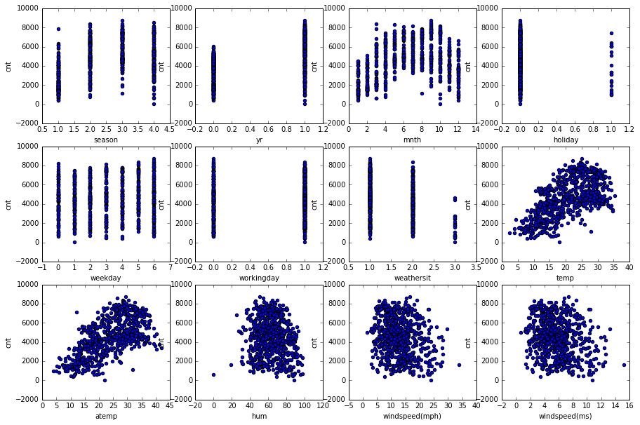
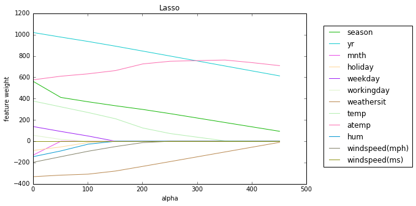
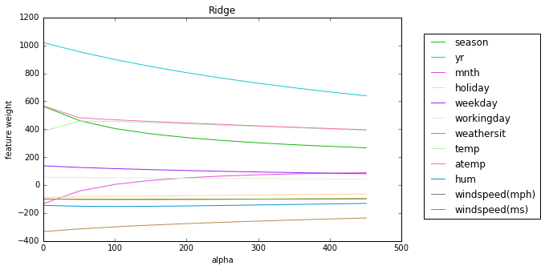
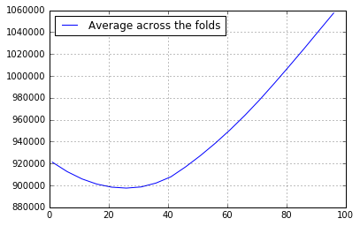
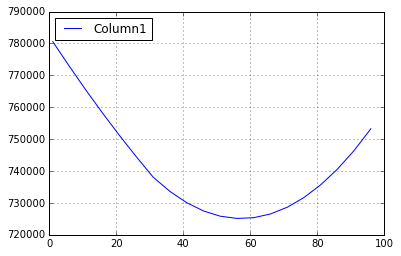
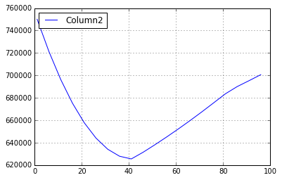
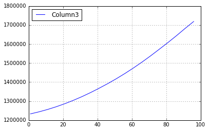

# Linear regression: retraining and regularization


```python
import pandas as pd
import numpy as np
from matplotlib import pyplot as plt
%matplotlib inline
```

Мы будем работать с датасетом __"bikes_rent.csv"__, в котором по дням записаны календарная информация и погодные условия, характеризующие автоматизированные пункты проката велосипедов, а также число прокатов в этот день. Последнее мы будем предсказывать; таким образом, мы будем решать задачу регрессии.

### Знакомство с данными


```python
df=pd.read_csv("bikes_rent.csv")
df.head(5)
```


<div>
<table border="1" class="dataframe">
  <thead>
    <tr style="text-align: right;">
      <th></th>
      <th>season</th>
      <th>yr</th>
      <th>mnth</th>
      <th>holiday</th>
      <th>weekday</th>
      <th>workingday</th>
      <th>weathersit</th>
      <th>temp</th>
      <th>atemp</th>
      <th>hum</th>
      <th>windspeed(mph)</th>
      <th>windspeed(ms)</th>
      <th>cnt</th>
    </tr>
  </thead>
  <tbody>
    <tr>
      <th>0</th>
      <td>1</td>
      <td>0</td>
      <td>1</td>
      <td>0</td>
      <td>6</td>
      <td>0</td>
      <td>2</td>
      <td>14.110847</td>
      <td>18.18125</td>
      <td>80.5833</td>
      <td>10.749882</td>
      <td>4.805490</td>
      <td>985</td>
    </tr>
    <tr>
      <th>1</th>
      <td>1</td>
      <td>0</td>
      <td>1</td>
      <td>0</td>
      <td>0</td>
      <td>0</td>
      <td>2</td>
      <td>14.902598</td>
      <td>17.68695</td>
      <td>69.6087</td>
      <td>16.652113</td>
      <td>7.443949</td>
      <td>801</td>
    </tr>
    <tr>
      <th>2</th>
      <td>1</td>
      <td>0</td>
      <td>1</td>
      <td>0</td>
      <td>1</td>
      <td>1</td>
      <td>1</td>
      <td>8.050924</td>
      <td>9.47025</td>
      <td>43.7273</td>
      <td>16.636703</td>
      <td>7.437060</td>
      <td>1349</td>
    </tr>
    <tr>
      <th>3</th>
      <td>1</td>
      <td>0</td>
      <td>1</td>
      <td>0</td>
      <td>2</td>
      <td>1</td>
      <td>1</td>
      <td>8.200000</td>
      <td>10.60610</td>
      <td>59.0435</td>
      <td>10.739832</td>
      <td>4.800998</td>
      <td>1562</td>
    </tr>
    <tr>
      <th>4</th>
      <td>1</td>
      <td>0</td>
      <td>1</td>
      <td>0</td>
      <td>3</td>
      <td>1</td>
      <td>1</td>
      <td>9.305237</td>
      <td>11.46350</td>
      <td>43.6957</td>
      <td>12.522300</td>
      <td>5.597810</td>
      <td>1600</td>
    </tr>
  </tbody>
</table>
</div>


Для каждого дня проката известны следующие признаки:
* _season_: 1 - весна, 2 - лето, 3 - осень, 4 - зима
* _yr_: 0 - 2011, 1 - 2012
* _mnth_: от 1 до 12 (соответственно январь---декабрь)
* _holiday_: 0 - нет праздника, 1 - есть праздник
* _weekday_: от 0 до 6 (соответственно понедельник---воскресенье)
* _workingday_: 0 - нерабочий день, 1 - рабочий день
* _workthersit_: оценка благоприятности погоды от 1 (чистый, ясный день) до 4 (ливень, туман)
* _temp_: температура в Цельсиях
* _atemp_: температура по ощущениям в Цельсиях
* _hum_: влажность
* _windspeed(mph)_: скорость ветра в милях в час
* _windspeed(ms)_: скорость ветра в метрах в секунду
* _cnt_: количество арендованных велосипедов (это целевой признак, его мы будем предсказывать)

Итак, у нас есть вещественные, бинарные и номинальные (порядковые) признаки, и со всеми из них можно работать как с вещественными. Давайте посмотрим на графиках, как целевой признак зависит от остальных


```python
fig, axes = plt.subplots(nrows=3, ncols=4, figsize=(15, 10))
for idx, feature in enumerate(df.columns[:-1]):
    df.plot(feature, "cnt", subplots=True, kind="scatter", ax=axes[idx / 4, idx % 4])
```

    /Users/a1/anaconda/lib/python3.5/site-packages/ipykernel/__main__.py:3: DeprecationWarning: using a non-integer number instead of an integer will result in an error in the future
      app.launch_new_instance()





Давайте более строго оценим уровень линейной зависимости между признаками и целевой переменной. Хорошей мерой линейной зависимости между двумя векторами является корреляция Пирсона. В pandas ее можно посчитать с помощью двух методов датафрейма: corr и corrwith. Метод df.corr вычисляет матрицу корреляций всех признаков из датафрейма. Методу df.corrwith нужно подать еще один датафрейм в качестве аргумента, и тогда он посчитает попарные корреляции между признаками из df и этого датафрейма.


```python
# Посчитайте корреляции всех признаков, кроме последнего, с последним с помощью метода corrwith:
df.ix[:,0:12].corrwith(df["cnt"])
```


    season            0.406100
    yr                0.566710
    mnth              0.279977
    holiday          -0.068348
    weekday           0.067443
    workingday        0.061156
    weathersit       -0.297391
    temp              0.627494
    atemp             0.631066
    hum              -0.100659
    windspeed(mph)   -0.234545
    windspeed(ms)    -0.234545
    dtype: float64


В выборке есть признаки, коррелирующие с целевым, а значит, задачу можно решать линейными методами.

По графикам видно, что некоторые признаки похожи друг на друга. Поэтому давайте также посчитаем корреляции между вещественными признаками.


```python
# Посчитайте попарные корреляции между признаками temp, atemp, hum, windspeed(mph), windspeed(ms) и cnt
# с помощью метода corr:
df.ix[:,7:13].corr()

```


<div>
<table border="1" class="dataframe">
  <thead>
    <tr style="text-align: right;">
      <th></th>
      <th>temp</th>
      <th>atemp</th>
      <th>hum</th>
      <th>windspeed(mph)</th>
      <th>windspeed(ms)</th>
      <th>cnt</th>
    </tr>
  </thead>
  <tbody>
    <tr>
      <th>temp</th>
      <td>1.000000</td>
      <td>0.991702</td>
      <td>0.126963</td>
      <td>-0.157944</td>
      <td>-0.157944</td>
      <td>0.627494</td>
    </tr>
    <tr>
      <th>atemp</th>
      <td>0.991702</td>
      <td>1.000000</td>
      <td>0.139988</td>
      <td>-0.183643</td>
      <td>-0.183643</td>
      <td>0.631066</td>
    </tr>
    <tr>
      <th>hum</th>
      <td>0.126963</td>
      <td>0.139988</td>
      <td>1.000000</td>
      <td>-0.248489</td>
      <td>-0.248489</td>
      <td>-0.100659</td>
    </tr>
    <tr>
      <th>windspeed(mph)</th>
      <td>-0.157944</td>
      <td>-0.183643</td>
      <td>-0.248489</td>
      <td>1.000000</td>
      <td>1.000000</td>
      <td>-0.234545</td>
    </tr>
    <tr>
      <th>windspeed(ms)</th>
      <td>-0.157944</td>
      <td>-0.183643</td>
      <td>-0.248489</td>
      <td>1.000000</td>
      <td>1.000000</td>
      <td>-0.234545</td>
    </tr>
    <tr>
      <th>cnt</th>
      <td>0.627494</td>
      <td>0.631066</td>
      <td>-0.100659</td>
      <td>-0.234545</td>
      <td>-0.234545</td>
      <td>1.000000</td>
    </tr>
  </tbody>
</table>
</div>


На диагоналях, как и полагается, стоят единицы. Однако в матрице имеются еще две пары сильно коррелирующих столбцов: temp и atemp (коррелируют по своей природе) и два windspeed (потому что это просто перевод одних единиц в другие). Далее мы увидим, что этот факт негативно сказывается на обучении линейной модели.

Напоследок посмотрим средние признаков (метод mean), чтобы оценить масштаб признаков и доли 1 у бинарных признаков.


```python
# Код 1.3 (0.5 балла)
# Выведите средние признаков

# binary
print("Binary: ", df["workingday"].mean(), df["yr"].mean(), df["holiday"].mean())

# all
df.mean()
```

    Binary:  0.6839945280437757 0.5006839945280438 0.028727770177838577


    season               2.496580
    yr                   0.500684
    mnth                 6.519836
    holiday              0.028728
    weekday              2.997264
    workingday           0.683995
    weathersit           1.395349
    temp                20.310776
    atemp               23.717699
    hum                 62.789406
    windspeed(mph)      12.762576
    windspeed(ms)        5.705220
    cnt               4504.348837
    dtype: float64


Признаки имеют разный масштаб, значит для дальнейшей работы нам лучше нормировать матрицу объекты-признаки.

### Проблема первая: коллинеарные признаки

Итак, в наших данных один признак дублирует другой, и есть еще два очень похожих. Конечно, мы могли бы сразу удалить дубликаты, но давайте посмотрим, как бы происходило обучение модели, если бы мы не заметили эту проблему. 

Для начала проведем масштабирование, или стандартизацию признаков: из каждого признака вычтем его среднее и поделим на дисперсию. Это можно сделать с помощью метода scale:


```python
from sklearn.preprocessing import scale
```


```python
X = scale(df[df.columns[:-1]])
y = df["cnt"]
```

Давайте обучим линейную регрессию на наших данных и посмотрим на веса признаков.


```python
from sklearn.linear_model import LinearRegression
#from sklearn import datasets, linear_model
```


```python
# Создайте объект линейного регрессора, обучите его на всех данных и выведите веса модели 
# (веса хранятся в переменной coef_ класса регрессора).
# Можно выводить пары (название признака, вес), воспользовавшись функцией zip, встроенной в язык python
# Названия признаков хранятся в переменной df.columns


# Create linear regression object
regr = LinearRegression()

# Train the model using the sets
regr.fit(X, y)

# The coefficients
print('Coefficients: \n', regr.coef_, "\n")
print('Feature:  Weight:')
      
for feature, coeff in zip(df.columns,regr.coef_.T):
    print(feature, coeff)
```

    Coefficients: 
     [  5.70872139e+02   1.02197001e+03  -1.41308189e+02  -8.67541011e+01
       1.37223510e+02   5.63921218e+01  -3.30226150e+02   3.67487655e+02
       5.85541888e+02  -1.45611765e+02   1.24604278e+13  -1.24604278e+13] 
    
    Feature:  Weight:
    season 570.872139061
    yr 1021.97000587
    mnth -141.308189083
    holiday -86.7541010698
    weekday 137.223509616
    workingday 56.3921217717
    weathersit -330.226149782
    temp 367.487655095
    atemp 585.541888233
    hum -145.611765359
    windspeed(mph) 1.24604278292e+13
    windspeed(ms) -1.24604278294e+13


Мы видим, что веса при линейно-зависимых признаках по модулю значительно больше, чем при других признаках.

Чтобы понять, почему так произошло, вспомним аналитическую формулу, по которой вычисляются веса линейной модели в методе наименьших квадратов:

$w = (X^TX)^{-1} X^T y$.

Если в X есть коллинеарные (линейно-зависимые) столбцы, матрица $X^TX$ становится вырожденной, и формула перестает быть корректной. Чем более зависимы признаки, тем меньше определитель этой матрицы и тем хуже аппроксимация $Xw \approx y$. Такая ситуацию называют _проблемой мультиколлинеарности_, вы обсуждали ее на лекции.

С парой temp-atemp чуть менее коррелирующих переменных такого не произошло, однако на практике всегда стоит внимательно следить за коэффициентами при похожих признаках.

__Решение__ проблемы мультиколлинеарности состоит в _регуляризации_ линейной модели. К оптимизируемому функционалу прибавляют L1 или L2 норму весов, умноженную на коэффициент регуляризации $\alpha$. В первом случае метод называется Lasso, а во втором --- Ridge. Подробнее об этом также рассказано в лекции.

Обучите регрессоры Ridge и Lasso с параметрами по умолчанию и убедитесь, что проблема с весами решилась.


```python
from sklearn.linear_model import Lasso, Ridge
```


```python
# Обучите линейную модель с L1-регуляризацией
regrL = Lasso()

# Train the model using the sets
regrL.fit(X, y)

# The coefficients
print('Coefficients: \n', regrL.coef_)
```

    Coefficients: 
     [  5.60241616e+02   1.01946349e+03  -1.28730627e+02  -8.61527813e+01
       1.37347894e+02   5.52123706e+01  -3.32369857e+02   3.76363236e+02
       5.76530794e+02  -1.44129155e+02  -1.97139689e+02  -2.80412806e-08]


```python
# Обучите линейную модель с L2-регуляризацией
regrR = Ridge()

# Train the model using the sets
regrR.fit(X, y)

# The coefficients
print('Coefficients: \n', regrR.coef_)
```

    Coefficients: 
     [  563.06457225  1018.94837879  -131.87332028   -86.746098     138.00511118
        55.90311038  -332.3497885    386.45788919   566.34704706  -145.0713273
       -99.25944108   -99.25944115]


### Проблема вторая: неинформативные признаки

В отличие от L2-регуляризации, L1 обнуляет веса при некоторых признаках. Объяснение последнему факту было дано на лекции (всё из-за ромбообразных линий уровня L1-нормы).

Давайте пронаблюдаем, как меняются веса при увеличении коэффициента регуляризации $\alpha$ (в лекции коэффициент при регуляризаторе мог быть обозначен другой буквой).


```python

```


```python
# Код 3.1 (1 балл)
alphas = np.arange(1, 500, 50)
coefs_lasso = np.zeros((alphas.shape[0], X.shape[1])) # матрица весов размера (число регрессоров) x (число признаков)
coefs_ridge = np.zeros((alphas.shape[0], X.shape[1]))
# Для каждого значения коэффициента из alphas обучите регрессор Lasso
# и запишите веса в соответствующую строку матрицы coefs_lasso (вспомните встроенную в python функцию enumerate),
# а затем обучите Ridge и запишите веса в coefs_ridge.

for i, a in enumerate(alphas):
    
    regrL = Lasso(alpha=a)

    # Train the model using the sets
    regrL.fit(X, y)

    # The coefficients
    weights=regrL.coef_
    
    for j, weight in enumerate(weights):
        coefs_lasso[i,j]=weight
        
for i, a in enumerate(alphas):
    
    regrR = Ridge(alpha=a)

    # Train the model using the sets
    regrR.fit(X, y)

    # The coefficients
    weights=regrR.coef_
    
    for j, weight in enumerate(weights):
        coefs_ridge[i,j]=weight

```

Визуализируем динамику весов при увеличении параметра регуляризации:


```python
plt.figure(figsize=(8, 5))

colors=[]
for feature in df.columns:
    colors.append(np.random.rand(3))

for coef, feature, color in zip(coefs_lasso.T, df.columns, colors):
    plt.plot(alphas, coef, label=feature, color=color)
plt.legend(loc="upper right", bbox_to_anchor=(1.4, 0.95))
plt.xlabel("alpha")
plt.ylabel("feature weight")
plt.title("Lasso")

plt.figure(figsize=(8, 5))
for coef, feature, color in zip(coefs_ridge.T, df.columns,colors):
    plt.plot(alphas, coef, label=feature, color=color)
plt.legend(loc="upper right", bbox_to_anchor=(1.4, 0.95))
plt.xlabel("alpha")
plt.ylabel("feature weight")
plt.title("Ridge")
```


    <matplotlib.text.Text at 0x11d9af2b0>








Далее будем работать с Lasso.

Итак, мы видим, что при изменении alpha модель по-разному подбирает коэффициенты признаков. Нам нужно выбрать наилучшее alpha. 

Для этого, во-первых, нам нужна метрика качества. Будем использовать в качестве метрики сам оптимизируемый функционал метода наименьших квадратов, то есть Mean Square Error.

Во-вторых, нужно понять, на каких данных эту метрику считать. Нельзя выбирать alpha по значению MSE на обучающей выборке, потому что тогда мы не сможем оценить, как модель будет делать предсказания на новых для нее данных. Если мы выберем одно разбиение выборки на обучающую и тестовую (это называется holdout), то настроимся на конкретные "новые" данные, и вновь можем переобучиться. Поэтому будем делать несколько разбиений выборки, на каждом пробовать разные значения alpha, а затем усреднять MSE. Удобнее всего делать такие разбиения кросс-валидацией, то есть разделить выборку на K частей, или блоков, и каждый раз брать одну из них как тестовую, а из оставшихся блоков составлять обучающую выборку. 

Делать кросс-валидацию для регрессии в sklearn совсем просто: для этого есть специальный регрессор, __LassoCV__, который берет на вход список из alpha и для каждого из них вычисляет MSE на кросс-валидации. После обучения (если оставить параметр cv=3 по умолчанию) регрессор будет содержать переменную __mse\_path\___, матрицу размера len(alpha) x k, k = 3 (число блоков в кросс-валидации), содержащую значения MSE на тесте для соответствующих запусков. Кроме того, в переменной alpha\_ будет храниться выбранное значение параметра регуляризации, а в coef\_, традиционно, обученные веса, соответствующие этому alpha_.

Обратите внимание, что регрессор может менять порядок, в котором он проходит по alphas; для сопоставления с матрицей MSE лучше использовать переменную регрессора alphas_.


```python
from sklearn.linear_model import LassoCV
```


```python
# Код 3.2 (1 балл)
# Обучите регрессор LassoCV на всех параметрах регуляризации из alpha
# Постройте график _усредненного_ по строкам MSE в зависимости от alpha. 
# Выведите выбранное alpha, а также пары "признак-коэффициент" для обученного вектора коэффициентов
alphas = np.arange(1, 100, 5)

model = LassoCV(alphas=alphas).fit(X, y)


plt.plot(model.alphas_, model.mse_path_.mean(axis=1), 
         label='Average across the folds')
plt.grid(True)
plt.legend(loc='upper left')

print("alpha=", model.alpha_)

regrL = Lasso(alpha=model.alpha_)

# Train the model using the sets
regrL.fit(X, y)

# The coefficients
weights=regrL.coef_

print('\nFeature:  Weight:')
      
for feature, coeff in zip(df.columns,regr.coef_.T):
    print(feature, coeff)

model.mse_path_
```

    alpha= 26
    
    Feature:  Weight:
    season 570.872139061
    yr 1021.97000587
    mnth -141.308189083
    holiday -86.7541010698
    weekday 137.223509616
    workingday 56.3921217717
    weathersit -330.226149782
    temp 367.487655095
    atemp 585.541888233
    hum -145.611765359
    windspeed(mph) 1.24604278292e+13
    windspeed(ms) -1.24604278294e+13


    array([[  753267.23026045,   700671.76274272,  1718461.08097625],
           [  746432.58657038,   695298.35222319,  1681896.07732212],
           [  740576.6213261 ,   690075.95134416,  1643966.8337877 ],
           [  735658.0746776 ,   683644.40198393,  1607573.66109515],
           [  731676.92099974,   675575.35991939,  1572772.15185076],
           [  728633.3699757 ,   667553.6575921 ,  1538270.21035084],
           [  726527.60063013,   659786.215239  ,  1505509.64556554],
           [  725359.76427163,   652291.03276507,  1474490.39304935],
           [  725129.98859493,   645068.25886666,  1445212.45243286],
           [  725838.3812339 ,   638117.98847422,  1417675.82371411],
           [  727485.03281523,   631440.2820496 ,  1391880.50689309],
           [  730070.01957267,   625492.4295994 ,  1367826.49508556],
           [  733593.40557781,   627919.06051988,  1344863.98875199],
           [  738055.24463873,   634129.98784559,  1323605.34605572],
           [  744411.63104751,   644090.1887887 ,  1304099.68703305],
           [  751044.38556796,   657796.74125399,  1286345.69363334],
           [  757980.27122017,   675247.65845667,  1270358.00059396],
           [  765219.54397653,   696441.48757385,  1256097.65572571],
           [  772762.12255073,   721377.16713656,  1243655.62670005],
           [  780571.85478961,   750143.57271585,  1232891.04325769]])




Итак, мы выбрали некоторый параметр регуляризации. Давайте посмотрим, какие бы мы выбирали alpha, если бы делили выборку только один раз на обучающую и тестовую, то есть рассмотрим траектории MSE, соответствующие отдельным блокам выборки.

```python
# Выведите значения alpha, соответствующие минимумам MSE на каждом разбиении (то есть по столбцам).
# На трех отдельных графиках визуализируйте столбцы .mse_path_

index_mins = model.mse_path_.argmin(axis=0)
print("alphas_min_columns=", model.alphas_[index_mins])

for i in range(3):
    plt.plot(model.alphas_, model.mse_path_[:,i], label='Column'+ str(i+1))
    plt.grid(True)
    plt.legend(loc='upper left')
    plt.show()

```

    alphas_min_columns= [56 41  1]










На каждом разбиении оптимальное значение alpha свое, и ему соответствует большое MSE на других разбиениях. Получается, что мы настраиваемся на конкретные обучающие и контрольные выборки. При выборе alpha на кросс-валидации мы выбираем нечто "среднее", что будет давать приемлемое значение метрики на разных разбиениях выборки. 
Наконец, как принято в анализе данных, давайте проинтерпретируем результат.


```python
zipped=zip(df.columns,regrL.coef_.T)

import operator
sorted(zipped, key=operator.itemgetter(1))
```


    [('weathersit', -323.67910842163866),
     ('windspeed(mph)', -170.44942053622722),
     ('hum', -122.41739716302786),
     ('holiday', -71.475853467463949),
     ('windspeed(ms)', -2.2574798165783592e-08),
     ('mnth', -0.0),
     ('workingday', 36.831355314954465),
     ('weekday', 113.41239026287381),
     ('temp', 348.31239784094117),
     ('season', 431.50501463394625),
     ('atemp', 599.39149098211283),
     ('yr', 997.59495798591058)]


### Заключение
Итак, мы посмотрели, как можно следить за адекватностью линейной модели, как отбирать признаки и как грамотно, по возможности не настраиваясь на какую-то конкретную порцию данных, подбирать коэффициент регуляризации. 

Стоит отметить, что с помощью кросс-валидации удобно подбирать лишь небольшое число параметров (1, 2, максимум 3), потому что для каждой допустимой их комбинации нам приходится несколько раз обучать модель, а это времязатратный процесс, особенно если нужно обучаться на больших объемах данных.
